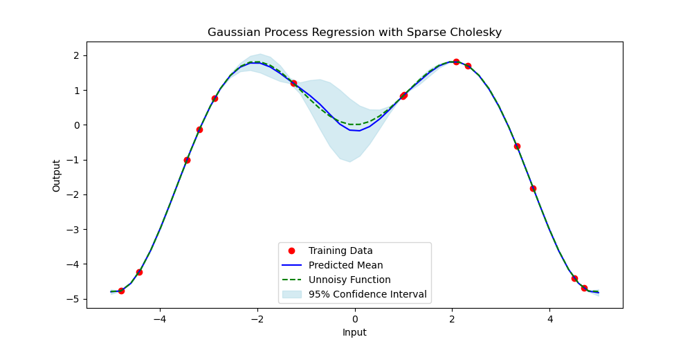

# kolesky

Python code for the paper [Sparse Cholesky Factorization by Kullback-Leibler Minimization](https://epubs.siam.org/doi/abs/10.1137/20M1336254)

Gaussian process (GP) regression can be approximated in two ways: a faster prediction points first and a more accurate prediction points last. Both methods accept the same hyperparameters: rho, lambda, and p for tuning accuracy. In general, the main parameter to tune is rho and accuracy will increase as rho increases until we reach the exact GP regression.

We will start by generating a synthetic dataset. The true equation is $f(x) = x\sin(x)$
```
import numpy as np

x_train = np.random.uniform(-5, 5, 15).reshape(-1, 1)
x_test = np.linspace(-5, 5, 50).reshape(-1, 1)
y_train = x_train * np.sin(x_train)
```
To fit a Gaussian process on this data, we choose to use an RBF kernel function for our covariance. We also choose rho = 10, lambda = 1.5, and p = 1.
```
import kolesky.gp_regresssion as kgp
import sklearn.gaussian_process.kernels as kernels

kernel = kernels.RBF(length_scale=1.0)
mu, var = gp.estimate(x_train, y_train.flatten(), x_test, kernel, 10.0, 1.5, p=1)
```
After fitting our model, we can create the following plot:
```
import matplotlib.pyplot as plt
plt.figure(figsize=(10, 5))
plt.plot(x_train[:, 0], y_train.flatten(), 'ro', label='Training Data')
plt.plot(x_test[:, 0], mu, 'b-', label='Predicted Mean')
plt.plot(x_test[:, 0], x_test[:, 0] * np.sin(x_test[:, 0]), 'g--', label='Unnoisy Function')
plt.fill_between(x_test[:, 0], mu - 1.96 * np.sqrt(var), mu + 1.96 * np.sqrt(var), color='lightblue', alpha=0.5, label='95% Confidence Interval')
plt.title('Gaussian Process Regression with Sparse Cholesky')
plt.xlabel('Input')
plt.ylabel('Output')
plt.legend()
plt.show()
```
